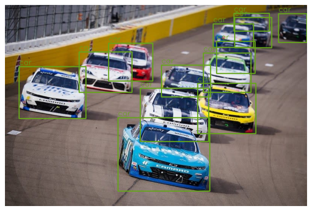
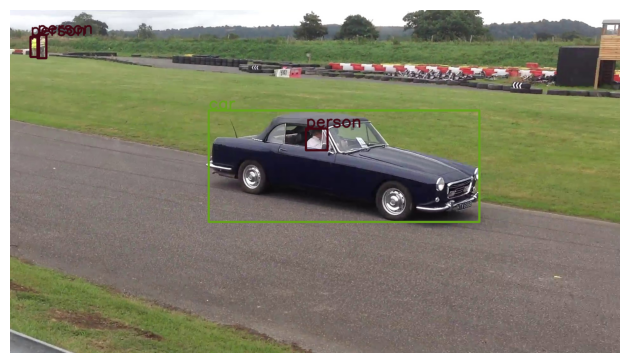
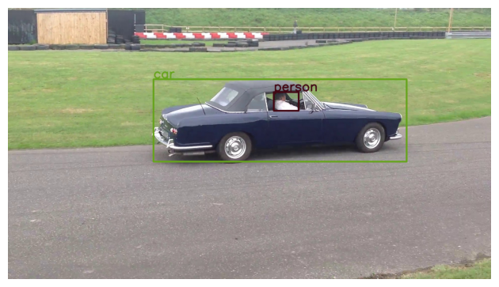
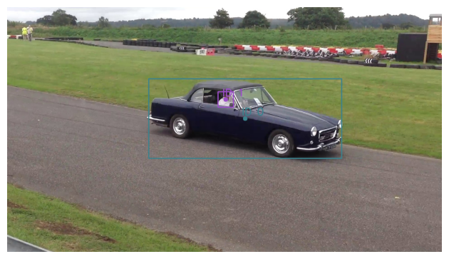
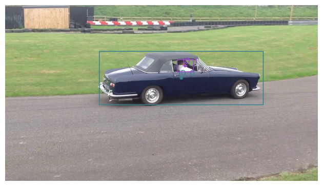

# Object-Tracking-with-FasterRCNN
**
This project implements object detection using a pretrained FasterRCNN model and a simple IoU-based multi-object tracker. It demonstrates how to detect objects in images and track them across multiple frames.
**

If you don't have access to a GPU, it's recommended to use Google Colab with a T4 GPU runtime.

## Object Detection
We use a pretrained FasterRCNN model from torchvision to perform object detection. The predict() function implements the forward pass, while run_detector() handles the entire detection process.

## Key Features:
- Utilizes pretrained FasterRCNN for efficient object detection
- Configurable confidence threshold for filtering detections
- Returns bounding boxes, confidence scores, and class labels
### Multi-Object Tracking
The project implements an IoU-based tracker following the method described by Bochinski et al as seen in this paper

[High-Speed tracking-by-detection without using image information](https://ieeexplore.ieee.org/document/8078516)

This tracker links detections across frames based on their Intersection-over-Union (IoU) with existing tracks.

## Results
The base object detector provides output like so:

For images having multiple objects, they get tracked at once

  

When the bounding boxes overlap, multi object tracking is facilitated

 

### Key Components:

iou() function: Computes IoU between two bounding boxes

track_iou() function: Implements the IoU-based tracking algorithm
